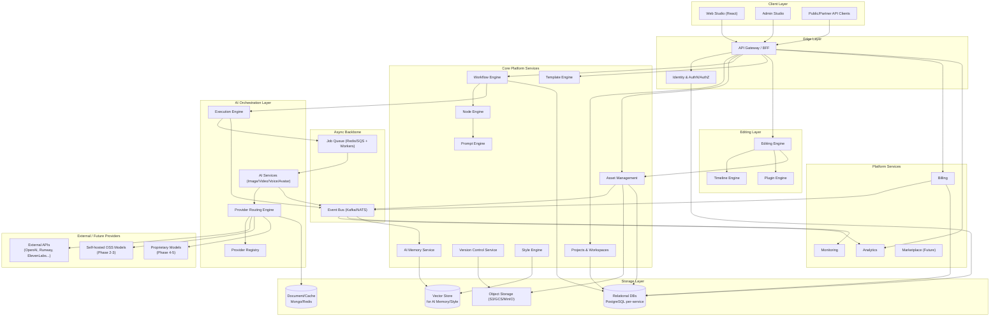
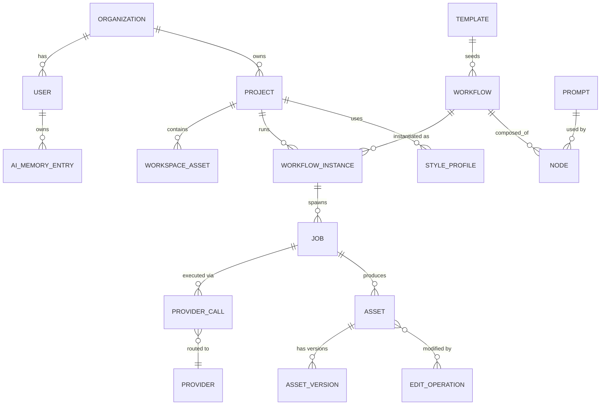
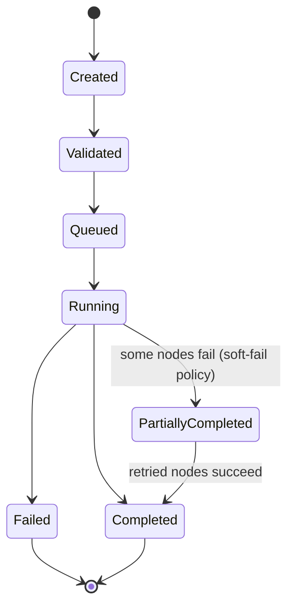
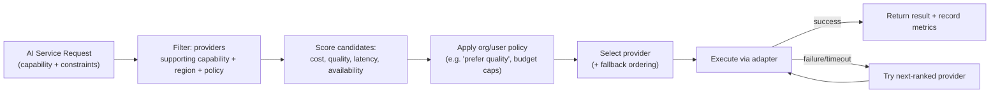
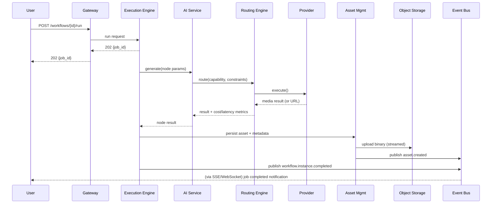
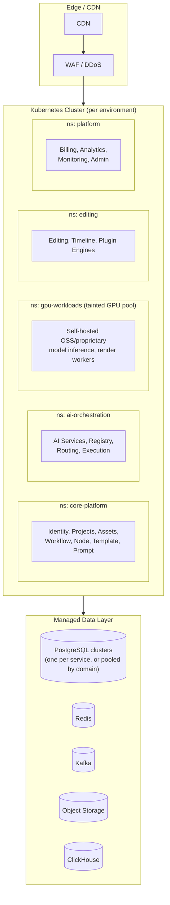

# AI Creative Studio Platform — System Design Document

**Version:** 1.0
**Based on:** AI Creative Studio Foundation Design v1
**Architecture style:** Polyglot microservices, event-driven, API-first
**Status:** Draft for engineering review

---

## Table of Contents

1. Executive Summary
2. Architecture Principles & Constraints
3. High-Level System Architecture
4. Service Catalog (per-module design)
5. Data Architecture
6. API Gateway & API Design
7. Workflow / Node / Template / Prompt Engines (deep dive)
8. Provider Registry & Routing Engine (deep dive)
9. Execution Engine, Job Queue & Event Bus
10. Media Storage & Asset Pipeline
11. Editing & Timeline Engine
12. Identity, Auth & Multi-Tenancy
13. Billing & Metering
14. Security Architecture
15. Deployment & Infrastructure Architecture
16. Scaling Plan
17. Observability & Monitoring
18. Non-Functional Requirements (SLOs)
19. Phase Roadmap → Technical Milestones
20. Risks & Mitigations

---

## 1. Executive Summary

The AI Creative Studio Platform is a vendor-neutral system that lets creators and businesses generate, edit, and manage AI media (images, video, audio, avatars, and future modalities) from one workspace. The platform must:

- Work with external AI providers today (OpenAI, Runway, ElevenLabs, Stability, etc.)
- Support open-source, self-hosted models tomorrow
- Support proprietary in-house models in the future
- Require **no architectural changes** as providers change — only new adapters.

This is achieved through a **service-oriented, event-driven microservices architecture** where every AI capability (image, video, voice, avatar) is abstracted behind a common `AI Service` interface, and a **Provider Routing Engine** decides at runtime which backend actually executes the request.

---

## 2. Architecture Principles & Constraints

Derived directly from the Foundation Design's Guiding Principles, made concrete:

| Principle | Engineering Implication |
|---|---|
| Everything is a service | Every module in Section 5 of the foundation doc is an independently deployable microservice with its own datastore ("database-per-service") |
| Everything is replaceable | All AI providers, storage backends, and queues sit behind interfaces (ports & adapters / hexagonal architecture) |
| Everything is versioned | Workflows, templates, prompts, and assets are immutable + versioned; nothing is edited in place |
| Everything is event-driven | Services communicate primarily via an event bus (async), not synchronous chains, to avoid cascading failures |
| Everything is reusable | Nodes, templates, and prompts are first-class, shareable, versioned objects — not embedded in application code |
| API-first, plugin-first | Every capability is exposed via a documented API before any UI is built; third-party plugins use the same public API surface as internal teams |

**Constraints:**
- Must support **polyglot services** (different languages per service, chosen for fit — e.g., Go for high-throughput routing/queueing, Python for AI/ML-adjacent orchestration, Node/TypeScript for BFF and real-time editor collaboration).
- Must support **multi-cloud / self-hosted** deployment (Phase 3+ requires GPU self-hosting), so avoid deep lock-in to one cloud's proprietary managed services where a portable alternative exists.
- Must isolate **tenant data** at the storage layer (multi-tenant SaaS).

---

## 3. High-Level System Architecture



**Layer summary:**

1. **Client Layer** — Web Studio, Admin Studio, and external partner integrations, all talking only to the Gateway.
2. **Edge Layer** — Single entry point (API Gateway/BFF) plus centralized Identity for authn/authz, rate limiting, and request shaping.
3. **Core Platform Services** — Domain services that manage projects, assets, workflows, templates, prompts, versioning, style, and long-term AI memory.
4. **AI Orchestration Layer** — The abstraction that decouples "what the user wants" from "which vendor executes it."
5. **Async Backbone** — Event bus for pub/sub domain events, job queue for long-running generation/render tasks.
6. **Editing Layer** — Post-generation editing, timeline composition, and plugin-based feature extension.
7. **Platform Services** — Cross-cutting concerns: billing, analytics, monitoring, marketplace.
8. **Storage Layer** — Polyglot persistence, chosen per access pattern.
9. **Providers** — External vendors today, OSS/self-hosted and proprietary models in later phases — all hidden behind the Routing Engine.

---

## 4. Service Catalog

Each module from the Foundation Design becomes a bounded, independently deployable service. Suggested language/runtime reflects the "polyglot" decision — pick the best tool per workload, not a single company-wide standard.

| # | Service | Responsibility | Suggested Stack | Datastore | Scaling Profile |
|---|---|---|---|---|---|
| 1 | Identity & Organizations | Auth, users, orgs, RBAC, SSO | Go / Node (NestJS) + OIDC provider (Keycloak/Auth0) | PostgreSQL | Low write, high read; horizontal + cache |
| 2 | Projects & Workspaces | Project CRUD, workspace membership, folders | Node (NestJS) / TypeScript | PostgreSQL | Moderate |
| 3 | Asset Management | Metadata, versions, tagging, search of all media | Go or Python (FastAPI) | PostgreSQL + OpenSearch/Elastic | High read, high write |
| 4 | Workflow Engine | Orchestrates node graphs into executable pipelines | Go (for concurrency) | PostgreSQL + Redis (state) | CPU-light, high concurrency |
| 5 | Node Engine | Defines/validates node types & graphs (drag-and-drop logic) | TypeScript (shared with frontend graph runtime) | PostgreSQL | Low |
| 6 | Template Engine | Stores/serves admin-authored reusable workflows/prompts | Node/TypeScript | PostgreSQL | Low-moderate, cache-heavy |
| 7 | Prompt Engine | Variable substitution, prompt versioning/validation | Python (rich text/NLP tooling) | PostgreSQL | Low |
| 8 | Provider Registry | Provider capability/pricing/health catalog | Go | PostgreSQL (+ Redis cache) | Low write, very high read |
| 9 | Provider Routing Engine | Real-time provider selection (cost/quality/latency/availability) | Go (low-latency decisioning) | Redis (hot state) + PostgreSQL (history) | Very high throughput, latency-critical |
| 10 | Execution Engine | Runs workflow instances asynchronously, tracks state | Go | PostgreSQL + Redis | High throughput |
| 11 | Job Queue | Durable task queue for generation/render jobs | Redis Streams / SQS / RabbitMQ (managed) | N/A (broker) | Elastic, horizontally scaled workers |
| 12 | Event Bus | Domain event pub/sub backbone | Kafka (or NATS JetStream for lighter footprint) | N/A (broker) | Elastic partitions |
| 13 | Media Storage | Binary storage, CDN delivery, signed URLs | S3-compatible object store + CDN | Object store | Elastic, near-infinite |
| 14 | Version Control | Immutable versioning of assets/workflows/templates/prompts | Go / Python | PostgreSQL + Object store (diffs/snapshots) | Moderate |
| 15 | Editing Engine | Unified plugin-based image/video edit operations | Rust or C++ core (perf) with Python/Node orchestration wrapper | PostgreSQL (edit state) + Object store | CPU/GPU-bound, worker pool |
| 16 | Timeline Engine | Layers, transitions, subtitles, animation composition | TypeScript (shares model with editor UI) + render workers (Rust/FFmpeg) | PostgreSQL | Bursty, render-heavy |
| 17 | Plugin Engine | Loads/sandboxes third-party & internal plugins | Node.js (VM/sandbox isolation) or WASM runtime | PostgreSQL | Low-moderate |
| 18 | AI Memory | Long-term context/preferences per user/org (style, characters, brand) | Python | Vector DB (pgvector/Pinecone/Qdrant) | Moderate, read-heavy |
| 19 | Style Engine | Style embeddings, consistency enforcement across generations | Python | Vector DB + PostgreSQL | Moderate |
| 20 | Billing | Usage metering, invoicing, plan enforcement | Node/TypeScript or Go | PostgreSQL (financial-grade, ACID) | Low volume, high correctness |
| 21 | Analytics | Usage/behavioral analytics, dashboards | Python (Spark/dbt) or ClickHouse-native | ClickHouse / BigQuery | Very high write (event ingestion), analytical reads |
| 22 | Monitoring | Health, metrics, tracing, alerting (see §17) | Prometheus/Grafana/OpenTelemetry stack | Prometheus TSDB / Loki | Elastic |
| 23 | Admin Studio | Internal tooling: manage providers, templates, tenants | Node/TypeScript (thin BFF over other services) | N/A (composes other services) | Low |
| 24 | Marketplace (Future) | Third-party templates/plugins/nodes, revenue share | Node/TypeScript | PostgreSQL | Low (Phase 5) |
| 25 | AI Services | Uniform Image/Video/Voice/Avatar interface consumed by Workflow/Execution | Python (async, close to ML tooling) | Stateless (delegates to Routing Engine) | Very high, GPU-adjacent |

**Design rule:** every service owns its own database (no shared schemas). Cross-service reads happen via the service's public API or via denormalized read models built from consumed events — never direct DB access across service boundaries.

---

## 5. Data Architecture

### 5.1 Persistence strategy by data shape

| Data shape | Store | Why |
|---|---|---|
| Transactional/relational (users, orgs, projects, billing) | PostgreSQL (one instance/cluster per service) | Strong consistency, mature tooling, JSONB for semi-structured fields |
| Binary media (images, video, audio) | S3-compatible object storage + CDN | Cost-efficient, infinitely scalable, native versioning/lifecycle policies |
| Hot/ephemeral state (routing decisions, session cache, job locks) | Redis | Sub-millisecond latency |
| Semantic/embedding data (style, memory, prompt similarity) | Vector DB (pgvector to start, Qdrant/Pinecone if scale demands) | Similarity search for style-consistency and memory recall |
| Event stream / audit log | Kafka (with tiered storage) | Durable, replayable, decouples producers/consumers |
| Analytical/OLAP (usage, funnels, cost analytics) | ClickHouse or BigQuery | Fast aggregation over billions of events |
| Search (asset discovery, tags, prompts) | OpenSearch/Elasticsearch | Full-text + faceted search |

### 5.2 Core entity model (simplified ERD)



### 5.3 Event catalog (selected core events on the Event Bus)

| Event | Producer | Key Consumers |
|---|---|---|
| `project.created` | Projects Service | Analytics, Billing |
| `workflow.instance.started` | Execution Engine | Analytics, Monitoring |
| `workflow.instance.completed` | Execution Engine | Asset Mgmt, Analytics, Billing |
| `job.queued` / `job.started` / `job.completed` / `job.failed` | Job Queue / Execution Engine | Monitoring, Analytics, Notification |
| `provider.call.succeeded` / `provider.call.failed` | Routing Engine | Provider Registry (health), Billing, Analytics |
| `asset.created` / `asset.versioned` | Asset Mgmt | Search Index, Analytics, AI Memory |
| `edit.applied` | Editing Engine | Version Control, Asset Mgmt |
| `usage.recorded` | AI Services / Billing | Billing, Analytics |
| `plugin.installed` | Plugin Engine | Analytics, Marketplace |

Event schemas are versioned (e.g., `asset.created.v1`) and registered in a schema registry (Confluent Schema Registry or a lightweight JSON Schema store) to guarantee compatibility as services evolve independently.

---

## 6. API Gateway & API Design

- **Gateway pattern:** Backend-for-Frontend (BFF) per client type (Web Studio BFF, Admin BFF, Public/Partner API) sitting behind a shared API Gateway (Kong/Envoy/NGINX) that handles TLS termination, rate limiting, and auth token validation.
- **External contract:** REST + JSON for the public/partner API (simplicity, wide client support); internal service-to-service calls use **gRPC** where low latency matters (Routing Engine, Execution Engine) and REST/HTTP+JSON elsewhere for simplicity.
- **Async-first for long operations:** Any generation/edit request returns `202 Accepted` with a `job_id`; clients poll `GET /jobs/{id}` or subscribe via WebSocket/SSE for completion — never long-lived synchronous HTTP calls for AI generation.
- **Versioning:** URL-based (`/v1/...`) for public API; breaking changes require a new version, old versions deprecated on a published timeline.
- **Idempotency:** All mutating endpoints accept an `Idempotency-Key` header, critical for generation requests that may be retried.

### 6.1 Representative endpoints

```
POST   /v1/projects
POST   /v1/projects/{id}/workflows
POST   /v1/workflows/{id}/run                → 202 { job_id }
GET    /v1/jobs/{job_id}
GET    /v1/jobs/{job_id}/events              (SSE stream)
POST   /v1/assets/{id}/edit                  → 202 { job_id }
GET    /v1/providers                          (registry, admin-scoped)
POST   /v1/providers/{id}/health-check        (admin-scoped)
POST   /v1/templates
POST   /v1/prompts
GET    /v1/organizations/{id}/usage
```

---

## 7. Workflow / Node / Template / Prompt Engines (deep dive)

**Node Engine** defines a typed graph model: each `Node` has typed input/output ports (e.g., `image`, `text`, `video`, `mask`), a `nodeType` (e.g., `text-to-image`, `upscale`, `inpaint`, `voiceover`), and configuration schema. Nodes are pure functions from the graph's point of view — side effects (actual AI calls) happen only when the Workflow Engine executes them via the Execution Engine.

**Workflow Engine** compiles a validated node graph (DAG — cycles are disallowed) into an executable plan: topological sort → dependency resolution → parallel execution where branches are independent. Workflow state machine per instance:



**Template Engine** stores admin-curated, versioned "starter" workflows + prompt sets (e.g., "Product Photo → 5 Ad Variants"). Templates are forked into a user's project as a new `Workflow` — templates themselves are never mutated by end users, preserving a clean library.

**Prompt Engine** handles `{{variable}}` placeholder substitution, prompt linting (token limits, banned terms), and prompt versioning so a workflow can be reproduced exactly later (critical for the "everything is versioned" principle and for audits).

---

## 8. Provider Registry & Routing Engine (deep dive)

This is the architectural core that fulfills the "no architectural changes as providers change" requirement.

### 8.1 Provider abstraction

Every provider (external API, OSS model, proprietary model) implements a common adapter interface:

```
interface AIProviderAdapter {
  capabilities(): Capability[]           // e.g. text-to-image, inpainting, lipsync
  estimateCost(request): CostEstimate
  estimateLatency(request): LatencyEstimate
  healthCheck(): HealthStatus
  execute(request): ProviderResult       // async; may stream progress
}
```

New providers are onboarded by writing one adapter and registering it — **zero changes to Workflow, Execution, or AI Services layers.**

### 8.2 Provider Registry

Stores, per provider: supported capabilities, pricing model (per-call, per-token, per-second), current health/uptime, rate limits, and region availability. Updated via:
- Static config (deploy-time) for baseline capabilities/pricing.
- Live health checks (every N seconds) feeding a rolling availability score.
- Cost data reconciled against actual billing (see §13) to correct drift between listed and real pricing.

### 8.3 Routing Engine decision flow



Scoring is a weighted function (weights configurable per org/plan):

```
score = w_cost * normalize(cost)
      + w_quality * normalize(quality_score)
      + w_latency * normalize(latency)
      + w_availability * normalize(uptime)
```

Routing decisions and outcomes are logged as events (`provider.call.succeeded/failed`) — this closes the loop so the registry's live health/quality scores self-correct over time (a lightweight feedback/learning loop, not full ML at Phase 1, upgradeable later).

### 8.4 Migration path (Phase 1 → 5)

Because routing is decision logic over a registry of interchangeable adapters, migrating from "100% external API" to "hybrid" to "mostly self-hosted/proprietary" is a **configuration and adapter-onboarding exercise**, not a re-architecture:
- Phase 2: add OSS-model adapters (e.g., self-hosted Stable Diffusion/ComfyUI, Whisper) alongside external ones; routing weights shift traffic gradually (canary-style, e.g., 5% → 25% → 100%).
- Phase 3: self-host the most expensive/high-volume capabilities on owned GPU infra (Kubernetes + GPU node pools, or bare-metal), keep external providers as fallback for burst capacity and capabilities not yet replicated.
- Phase 4: fine-tuned proprietary models plug in as another adapter, prioritized by quality score for relevant capabilities.
- Phase 5: full in-house stack; external providers can be kept purely as overflow/DR fallback or removed entirely — routing config change, not code change.

---

## 9. Execution Engine, Job Queue & Event Bus

- **Job Queue** is the durable work-distribution layer: Workflow Engine enqueues node-level tasks; a pool of stateless workers (auto-scaled) pulls tasks, calls the appropriate AI Service, writes results to Asset Management, and acknowledges the job.
- **Execution Engine** owns workflow-instance orchestration: tracks per-node status, handles retries with exponential backoff, enforces per-org concurrency limits, and emits lifecycle events.
- **Event Bus (Kafka)** decouples every service from every other — e.g., Billing doesn't need to know Execution Engine exists; it just consumes `usage.recorded` events. This is what allows independent scaling and deployment of 25 services without a combinatorial explosion of point-to-point integrations.

**Failure handling:**
- Node-level retry (configurable, default 3 attempts, exponential backoff + jitter).
- Provider-level fallback (handled by Routing Engine, §8.3) before a node is marked failed.
- Dead-letter queue for jobs that exhaust retries → surfaced to Monitoring + user-facing job status.
- Workflow-level policy: **fail-fast** (abort whole run) vs **best-effort** (continue independent branches, mark workflow `PartiallyCompleted`) — configurable per workflow.

---

## 10. Media Storage & Asset Pipeline



- Binaries are streamed directly to object storage (never buffered fully in service memory) with server-side encryption at rest.
- CDN sits in front of object storage for read delivery; signed, time-limited URLs prevent unauthorized access to private tenant media.
- **Asset Management** stores only metadata (pointer to object storage key, dimensions, format, checksum, tags, lineage back to the workflow/prompt/version that produced it) in PostgreSQL, plus a search index (OpenSearch) for discovery.
- Lifecycle policies (tiering to cold storage, expiry for trial-tier orgs) are config-driven per plan.

---

## 11. Editing & Timeline Engine

- **Editing Engine** exposes a plugin-based operation model: crop, upscale, inpaint, color-grade, background-remove, etc., each implemented as a plugin conforming to a common `EditOperation` interface — mirrors the AI provider adapter pattern so new edit capabilities (including AI-powered ones, which themselves route through the Provider Routing Engine) can be added without touching core editor code.
- **Timeline Engine** models video/audio composition as layered tracks (video, audio, subtitle, overlay) with keyframes and transitions; render jobs are submitted to the Job Queue and executed by GPU/CPU render workers (FFmpeg/Rust-based) rather than inline in the API path.
- Every edit operation is recorded via **Version Control** as an immutable diff/snapshot, so any asset's full history (prompt → generation → every edit) is reconstructable — supporting both UX ("revert to earlier version") and compliance/audit needs.

---

## 12. Identity, Auth & Multi-Tenancy

- **AuthN:** OIDC/OAuth2 (delegate to Keycloak or Auth0 rather than building from scratch), supporting SSO (SAML/OIDC) for enterprise orgs.
- **AuthZ:** RBAC at the org/workspace/project level (`owner`, `admin`, `editor`, `viewer`), enforced at the Gateway (coarse) and re-checked at each service (defense in depth) via short-lived signed JWTs carrying org/role claims.
- **Multi-tenancy model:** shared infrastructure, **tenant-scoped rows** (every table carries `org_id`) for most services; enterprise/high-compliance tenants can be offered dedicated database schemas or fully isolated deployments as a premium tier.
- All cross-service calls propagate a `tenant context` (org_id + request trace id) so authorization and data isolation are enforced consistently and traceable end-to-end.

---

## 13. Billing & Metering

- Every provider call and internal compute-heavy operation emits a `usage.recorded` event with: org_id, capability, provider used, cost incurred, units consumed (tokens/seconds/images).
- Billing service aggregates usage events into a ledger (append-only, ACID PostgreSQL) — never recomputed from other services' mutable state, ensuring auditability.
- Supports both **pass-through provider cost + margin** pricing and **flat subscription with usage caps**, since the routing layer already knows real-time cost per provider.
- Reconciliation job compares Provider Registry's estimated cost vs. actual invoiced cost from vendors periodically, feeding back into routing's cost-scoring accuracy (§8.3).

---

## 14. Security Architecture

- **Perimeter:** WAF + API Gateway rate limiting + DDoS protection (CloudFlare/AWS Shield) in front of all public endpoints.
- **Secrets:** provider API keys and credentials stored in a dedicated secrets manager (Vault/AWS Secrets Manager), never in service config or code; Routing Engine adapters fetch short-lived credentials at call time.
- **Data isolation:** tenant-scoped queries enforced by an ORM-level guard (query interceptor that injects `org_id` filter) to prevent cross-tenant leakage even from a coding mistake.
- **Encryption:** TLS everywhere in transit; AES-256 at rest for object storage and databases.
- **Content safety:** a moderation step (configurable, can itself be a provider adapter — e.g., an external moderation API) sits between Prompt Engine output and provider execution, and again on generated output before it's stored/delivered, to catch disallowed content regardless of which provider produced it.
- **Plugin sandboxing:** third-party plugins (Plugin/Marketplace, Phase 5) run in isolated runtimes (WASM or containerized sandboxes) with capability-scoped permissions — no direct database or filesystem access.
- **Audit log:** every mutating action across services is emitted as an event and retained in an immutable audit store, queryable per org for compliance.

---

## 15. Deployment & Infrastructure Architecture

### 15.1 Platform

- **Container orchestration:** Kubernetes (self-managed or managed — EKS/GKE/AKS), one cluster per environment (dev/staging/prod), with **namespace-per-service-domain** for blast-radius isolation.
- **GPU workloads** (self-hosted models, Phase 2+; render workers): dedicated GPU node pools with taints/tolerations so GPU capacity is only consumed by workloads that need it; autoscaled via KEDA on queue depth rather than CPU%.
- **Service mesh:** Istio or Linkerd for mTLS between services, traffic shaping (canary releases for new provider adapters or model versions), and consistent observability instrumentation.
- **Infrastructure as Code:** Terraform for cloud resources, Helm charts per service for k8s manifests — every environment reproducible from code.

### 15.2 Deployment topology



### 15.3 CI/CD

- Trunk-based development, per-service pipelines (build → test → container scan → deploy to staging → automated smoke tests → progressive rollout to prod via canary/blue-green).
- Contract tests between services (consumer-driven contracts, e.g., Pact) run in CI to catch breaking API/event-schema changes before merge — essential given the number of independently deployed services.
- Feature flags (e.g., LaunchDarkly or open-source Unleash) gate risky changes (new provider adapters, new routing weights) independent of deploys.

---

## 16. Scaling Plan

| Dimension | Strategy |
|---|---|
| **Stateless services** (Gateway, Node/Template/Prompt/Workflow APIs) | Horizontal Pod Autoscaler on CPU + request latency; scale-to-many small pods rather than few large ones |
| **Job Queue workers** | KEDA-based autoscaling on queue depth (not CPU) — scale workers up the moment backlog grows, down to near-zero off-peak |
| **Routing Engine** | Kept stateless + Redis-cached registry data so it can scale horizontally to handle very high call volume with sub-50ms decisioning |
| **GPU inference (self-hosted, Phase 2+)** | Separate autoscaling group from CPU services; scale on GPU utilization + queue depth; scale-to-zero for low-traffic model variants where cold-start latency is acceptable |
| **Databases** | Read replicas per service for read-heavy services (Asset Mgmt, Provider Registry); connection pooling (PgBouncer) cluster-wide; sharding by `org_id` considered once a single service's data volume outgrows one primary (design tables with `org_id` as a natural shard key from day one) |
| **Event Bus (Kafka)** | Partition topics by `org_id` or `entity_id` to preserve ordering per entity while parallelizing across partitions; scale consumer groups independently per service |
| **Object storage / CDN** | Effectively infinite; cost-scaling handled via storage tiering and cache-hit-ratio optimization, not an engineering bottleneck |
| **Multi-region** | Start single-region (Phase 1), design services stateless + externalize state to regional data stores so a second region can be added (active-passive DR first, active-active later) without redesign |
| **Cost-aware scaling** | Routing Engine's cost-weighting doubles as a natural cost-control lever platform-wide — during traffic spikes, routing can temporarily favor cheaper providers to control burn rate, independent of infra autoscaling |

**Capacity model (illustrative, to be refined with real traffic data):**
- Phase 1 target: support O(10K) monthly active creators, O(100K) generation jobs/day, p95 job completion (excluding provider generation time) under 2s of platform overhead.
- Design headroom: architecture should support 10x this without structural changes (only more replicas/workers), given the stateless-service + external-state design above.

---

## 17. Observability & Monitoring

- **Metrics:** Prometheus (or cloud-managed equivalent) scraping every service; Grafana dashboards per domain (AI orchestration, editing, platform).
- **Tracing:** OpenTelemetry distributed tracing across the full request path — critical here because a single user action (e.g., "run workflow") fans out across 6+ services and an external provider call; trace id propagated from Gateway through Event Bus messages too.
- **Logging:** structured JSON logs shipped to a central store (Loki/ELK), correlated by trace id.
- **Provider health dashboard:** real-time view of each provider's success rate, latency distribution, and cost trend — feeds both the Routing Engine and human on-call decisions (e.g., manually deprioritizing a degraded provider).
- **Alerting:** SLO-burn-rate alerts (see §18) rather than static thresholds where possible, routed via PagerDuty/Opsgenie.
- **Business/product observability:** Analytics service surfaces funnel metrics (workflow completion rate, provider cost per generation, template adoption) separately from operational monitoring — different audiences, different retention needs.

---

## 18. Non-Functional Requirements (SLOs)

| Requirement | Target (Phase 1 baseline) |
|---|---|
| API Gateway availability | 99.9% |
| Core platform services (Projects, Assets, Workflow CRUD) availability | 99.9% |
| Job acceptance (enqueue) latency | p95 < 300ms |
| Platform overhead added per generation job (excluding provider's own generation time) | p95 < 2s |
| Provider fallback trigger time (on failure/timeout) | < 5s to attempt next provider |
| Data durability (assets in object storage) | 99.999999999% (11 nines, standard object storage SLA) |
| RPO (Recovery Point Objective) | ≤ 15 minutes |
| RTO (Recovery Time Objective) | ≤ 1 hour (Phase 1, single-region + backups); improves with multi-region DR later |
| Audit log retention | ≥ 1 year (longer for regulated tenants, configurable) |

---

## 19. Phase Roadmap → Technical Milestones

| Phase (from Foundation Design) | Technical Milestones |
|---|---|
| **Phase 1: External APIs** | Stand up core platform services, Event Bus, Job Queue, Provider Registry/Routing with adapters for 3-5 major external providers (image + video). Workflow/Node/Template/Prompt engines MVP. Basic billing + monitoring. Single region. |
| **Phase 2: Hybrid (APIs + OSS)** | Add self-hosted GPU node pool; onboard OSS model adapters (Stable Diffusion variants, Whisper, open TTS); introduce canary traffic-shifting in routing weights; expand AI Memory/Style Engine. |
| **Phase 3: Self-host expensive models** | Scale GPU infra (dedicated pools/bare-metal), migrate highest-cost/highest-volume capabilities off external APIs; add multi-region consideration for GPU capacity and latency. |
| **Phase 4: Fine-tuned proprietary models** | Introduce model training/fine-tuning pipeline (separate from serving path); Research Team owns model lifecycle; proprietary adapters plug into existing Routing Engine with elevated quality scores. |
| **Phase 5: End-to-end proprietary infra** | Marketplace opens (plugin sandboxing, revenue share via Billing); external providers become optional overflow/DR only; full in-house AI stack; platform matures into a two-sided ecosystem. |

This mapping confirms the core design goal: **Phases 2–5 are additive** (new adapters, new node pools, new services like Marketplace) rather than replacements of Phase 1's architecture — validating the "no architectural changes" requirement from the Foundation Design.

---

## 20. Risks & Mitigations

| Risk | Mitigation |
|---|---|
| Vendor API changes/deprecation breaking adapters | Adapter contract tests run against provider sandboxes in CI; Routing Engine automatically deprioritizes a failing provider via health scoring, minimizing user-facing impact |
| Cost overrun from uncontrolled provider usage | Per-org budget caps enforced at Routing Engine before dispatch; real-time usage events feed Billing for near-real-time spend visibility |
| Event Bus becomes a single point of failure | Kafka run as a multi-broker cluster with replication; critical synchronous paths (e.g., job acceptance ack) do not block on downstream event consumption |
| Data model drift across 25 independently-owned services | Schema registry for events; consumer-driven contract tests in CI; API versioning policy enforced at Gateway |
| GPU self-hosting (Phase 2+) operational complexity | Start with managed GPU offerings (cloud) before bare-metal; treat as another provider in the registry so it can be rolled back to external routing instantly if unstable |
| Multi-tenant data leakage | ORM-level tenant guard + automated tests that attempt cross-tenant access in CI; periodic access audits |
| Plugin/Marketplace security (Phase 5) | Sandboxed execution (WASM/container), capability-scoped permissions, manual + automated review pipeline before publishing |
| Over-engineering Phase 1 for Phase 5 scale | Build the *interfaces* (adapter pattern, event contracts) for extensibility now, but implement only what Phase 1 needs behind them — avoid speculative infrastructure spend |

---

*End of System Design Document.*
